# **PokerGame**

## 如何运行它
1. 确保你的pc环境为windows环境
2. 在PokerGame文件夹中找到build文件夹，双击它
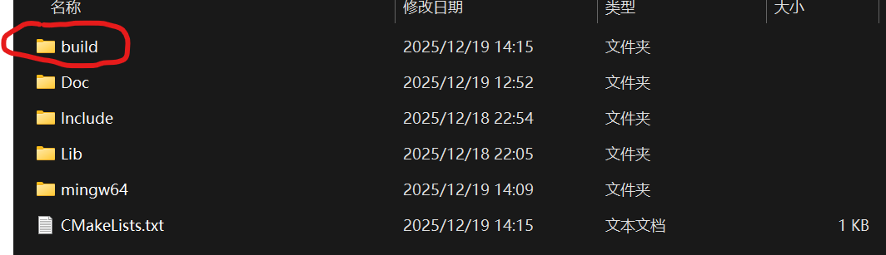
3. 在build文件夹中找到Doc文件夹，双击它
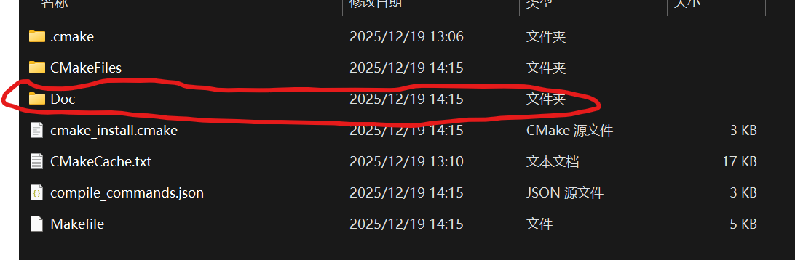   
4. 在Doc文件夹中找到PokerGame.exe，双击它
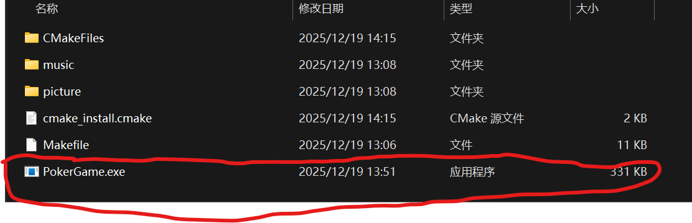   
5. 如运行成功应显示如下图片并伴随着欢乐斗地主的背景音乐
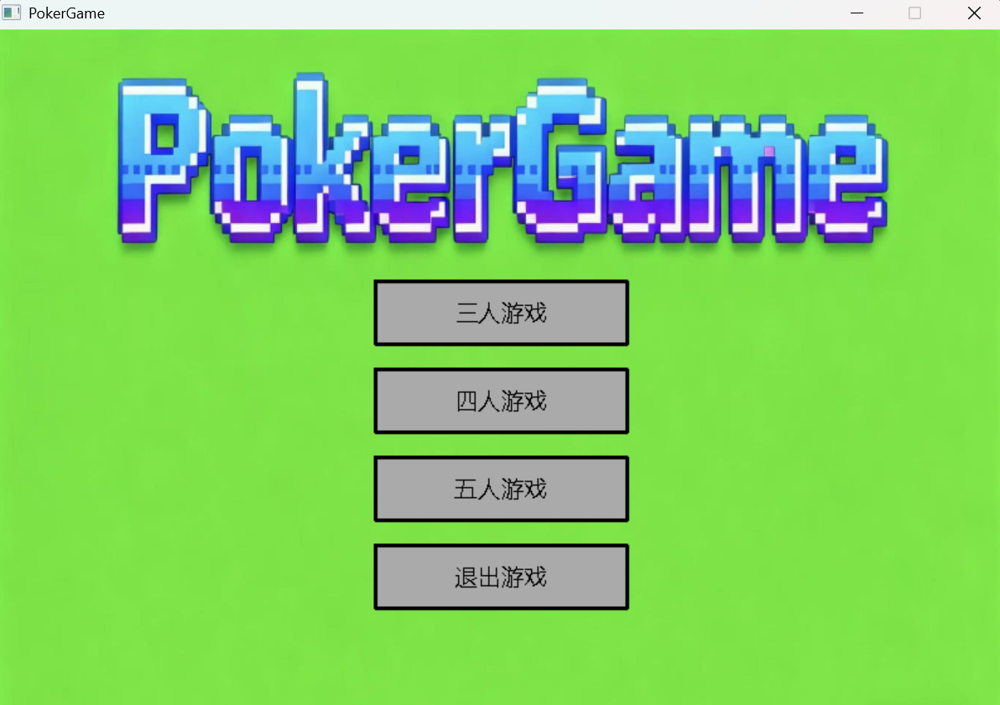
---  

## 如果更改了源代码如何编译运行它
1. 请确保**没有新增**任何文件
2. 请确保安装了CMake[安装教程](https://www.runoob.com/cmake/cmake-install-setup.html)  
3. **CMake GUI**  
	1. 打开CMakeGUI程序（找不到在windows菜单搜索CMake）
    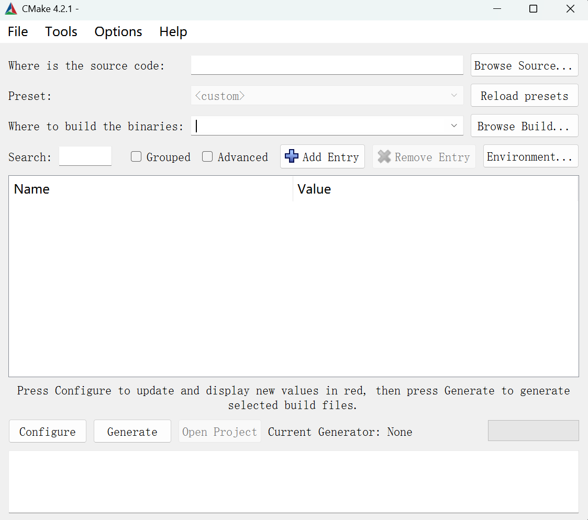
	2. Where is the source code一栏填写PokerGame在您的电脑上的**绝对路径**，例：D:\PokerGameRepository\PokerGame
    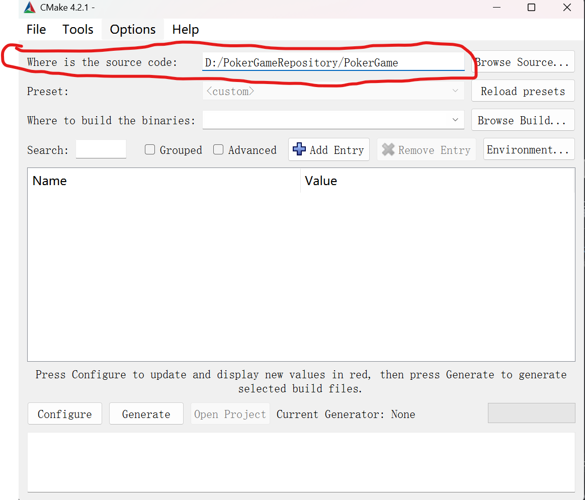
	3. Where to build the binaries一栏填写build文件夹在您电脑上的**绝对路径**，例：D:\PokerGameRepository\PokerGame\build
    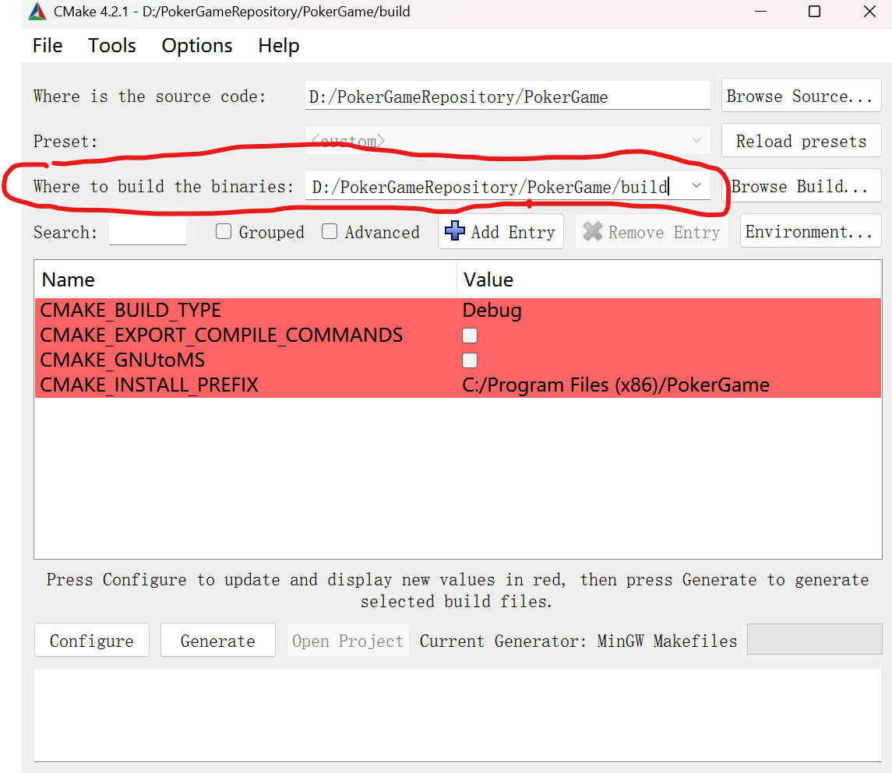
   此时下方出现红色是正常现象
    4. 接下来点击Configure键，此时之前的红色会消失，如正常运行，会出现**Configuring done (0.1s)** 字样
	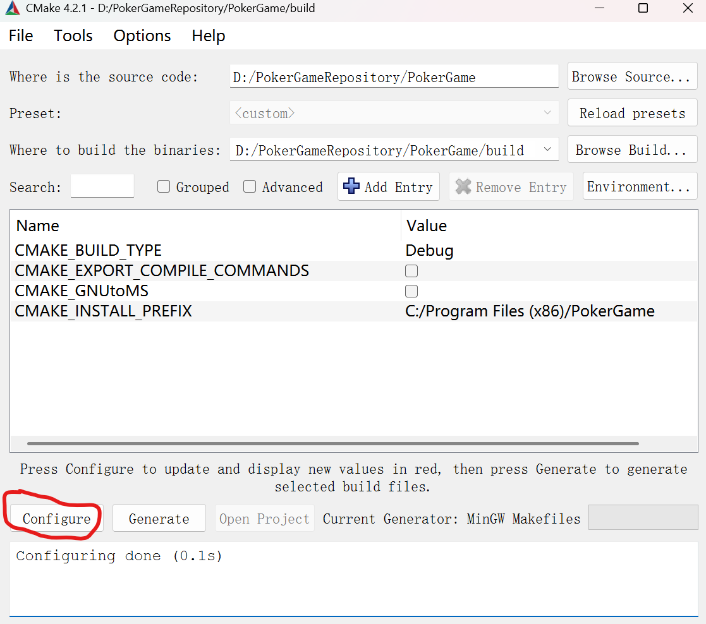
	5. 接下来点击Generate键，如正常运行，会出现 **Generating done (0.1s)** 字样
    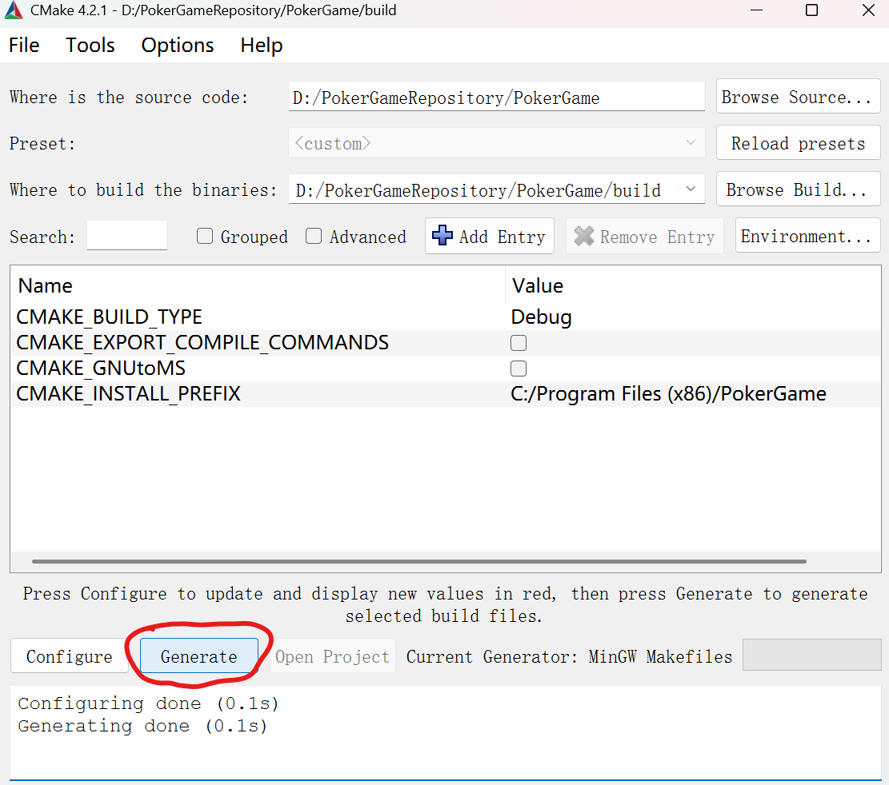
	6. 打开终端，输入指令:**cd 您电脑上build文件夹的绝对路径**（例：cd D:\PokerGameRepository\PokerGame\build）
	7. 输入指令：**mingw32-make -j4**
    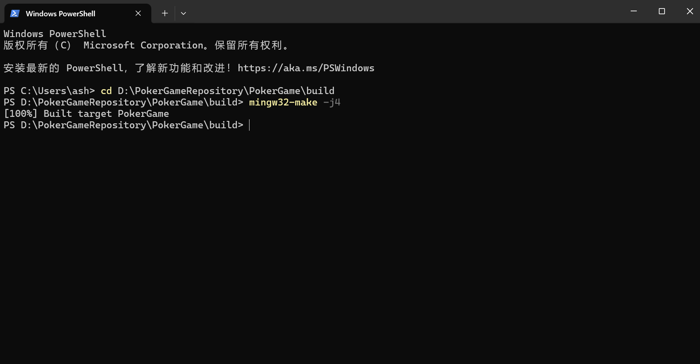
4. 如您的情况大体与图片相符，则您编译成功了，运行与上一点相同

---

## 文件结构
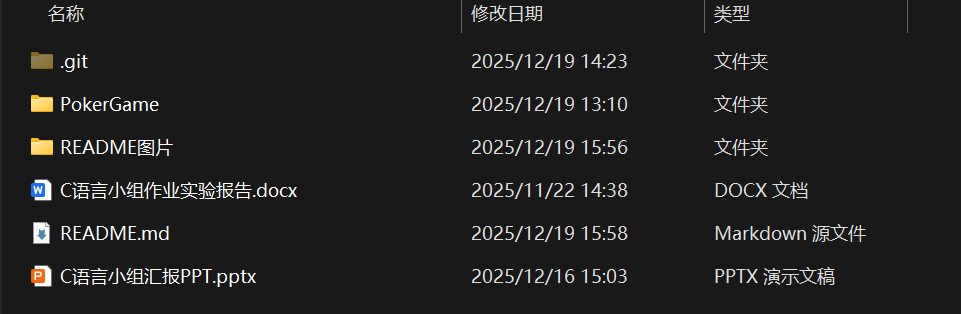
### **1. PokerGame文件夹**：项目源码存放处
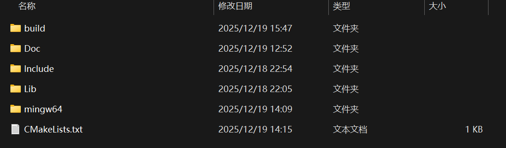
1. Doc文件夹主要是.cpp文件，为各种函数的定义和主逻辑与主函数编写的地方
2. Include是.h文件所在的地方
3. Lib为easyx库的库文件所在地
4. mingw64为我们为您提供的编译器，项目指定使用该编译器编译以杜绝可能存在的兼容性问题
5. build文件夹为CMake生成的文件夹
### **2. 其他**
1. .git文件夹用于Git版本管理
2. README图片文件夹存储本README所需的图片
3. C语言小组作业实验报告为本项目实验报告
4. C语言小组汇报PPT为本小组汇报时用的PPT

## 模块流程
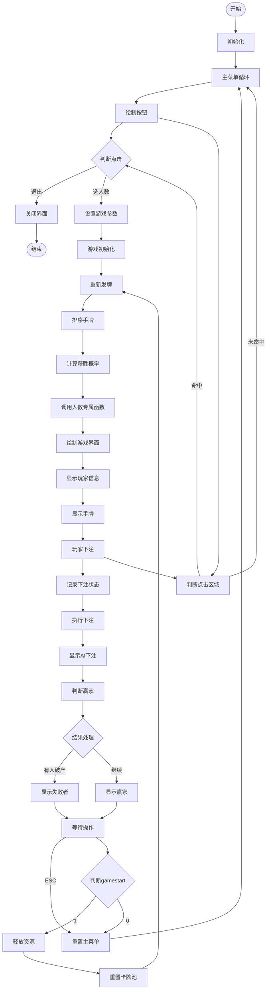
## 关于小组作业的事项安排:
1. 我们将采用Github进行版本管理与更新日志汇总，方便统一进度、小组合作
2. 我们需要将自定义函数统一在一个 .c 文件中编写，并统一在一个 .h 文件中声明
3. 我们将遵循看变量名与函数名知道功能的命名规则，不允许使用拼音命名法，同时每个变量定义时旁边应有注释注明功能
4. 我们不应出现莫名奇妙的常数，如出现常数，要么使用注释，要么使用#define
5. 常量命名应为全大写英语，若单词过长请使用下划线隔开，如：SUDENT_GRADE
6. 变量名如过长一样应采取下划线分割的方式，不过请使用小写字母
7. 我们将采用 .docx 格式编写报告文档
8. 我们将采用markdown编写日志、更新等
9. 其余代码风格与谷歌风格相同
	   
	

---
## 游戏规则
1. 玩家选择是否继续游戏
2. 输入玩家数量
3. 为每位玩家发五张牌
4. 点数中1为最小点，13为最大点
5. 花色从小到大依次为：♦、♣、♥、♠
6. 比较每位玩家的牌型的大小，大者胜  
   从大到小依次是：  
	1. 同花顺（花色相同的顺子）   
	2. 顺子（点数依次递增的五张牌）  
	3. 炸弹（四张点数相同的牌）  
	4. 三带二（三张点数相同的牌带上一对对子）  
	5. 三张（三张点数相同的牌）  
	6. 两对（两对对子）  
	7. 对子（两张点数相同的牌）
7. 若牌型相同，则比较玩家手牌中关键牌（让其拥有牌型的牌）的点数大小，若有多张，取最大
8. 若该点数还相同，则比较关键牌花色大小

   
### 关于下注规则

所有玩家一开始都有相等的资产，每局玩家都必须进行一个固定数值的下注。玩家一开始能看到自己的全部牌，而只能看到其余玩家的部分牌（比如每人都展示三张牌），这时电脑玩家应基于自己的手牌，通过胜负预测函数进行胜率预测，该预测数值达到某一值后，电脑会选择翻倍赌注。同样的，人类玩家也应结合场上情况，判断自己是否翻倍，最终获胜者会获得其余玩家下的赌注乘上对应倍数的资产，直到任意玩家资产为0 / 人类玩家退出游戏

# 更新日志
 
## 2025.11.19  21:32 
 
创建了Github的项目仓库，新增README，PPT和word文档

## 2025.11.22  14:40

简单地构建了代码框架，其中Library用于存放.h文件，Doc用于存放.c文件  

加入了有关是否退出或继续、输入玩家数量、发牌的函数

## 2025.11.22  22:22
 
完成了判断胜负的函数的书写

## 2025.11.23  22:52

简单修改了判断胜负的逻辑使其更符合直觉

在README中加入了待办事项便于合作

在README中加入了详细的游戏规则

完善了对卡牌的显示

## 2025.12.19  19:09
使用CMake重新构建了代码架构，保证了代码的可移植性

完善了README的书写，保证了易用性，方便操作
 
---
# 待办事项
- [x] 加入下注功能
- [x] 加上预测胜率功能
- [x] 将是否继续游戏、发牌、看牌等部分使用EasyX库图形化